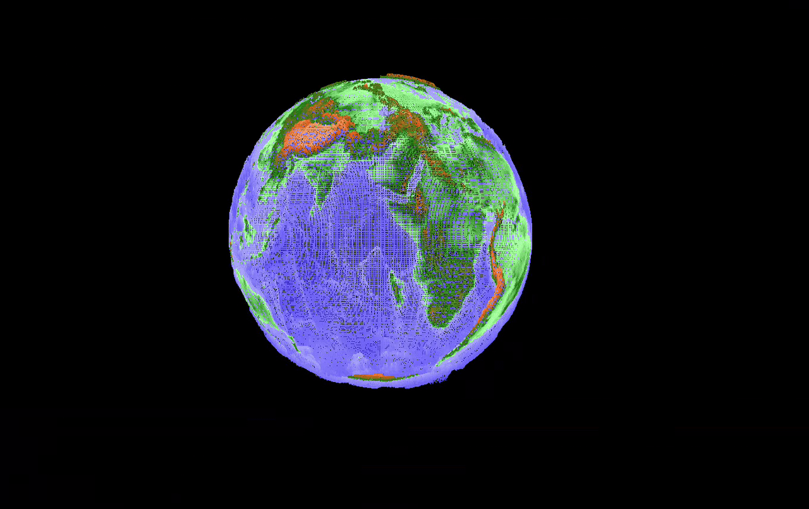
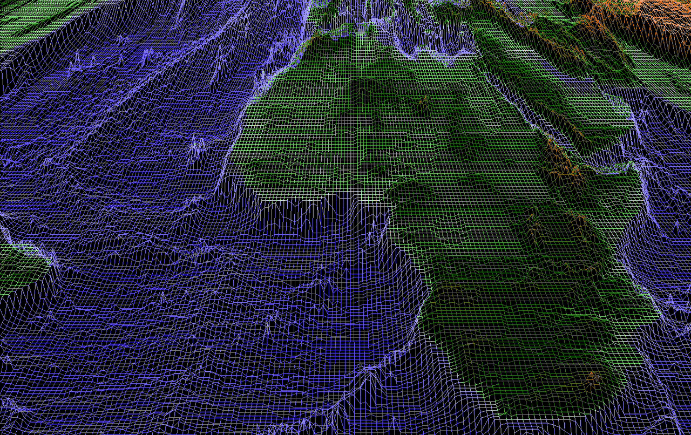

*This project has been created as part of the 42 curriculum by dgajowni

# FDF — Fil de Fer

## Description

This project aims to present a heightmap as a three-dimensional image. In addition to meeting the basic requirements, I decided to enhance the project with a spherical map projection and automatic and manual rotation, allowing the Earth map to be presented as realistically as possible. Visual color and elevation correction is also available.

## Instructions


### Installation
```bash
cd minilibx-linux
make
cd ..
make
./fdf <map_file>
```

### Controls

#### Interface

| Action                                 | Control                    |
| -------------------------------------- | -------------------------- |
| Turn on/off sphere view                      | `S`                        |
| Switch mouse swipe mode between move/rotation (when sphere mode enabled)            | `W`                   |
| Auto sphere rotation on/off                   | `Q`  |
| Normal/side view switch                 | `A`  |
| Color correction | `D/F` |
| Topographic correction                  | `E/R` |
| Colorfill spaces           | `V`             |
| Grid visibility on/off (when spaces filled by color) | `B` |
| Moving map/rotate sphere                   | `Mouse swipe` |
| Zoom                   | `Mouse wheel` |
| Rotate                   | `Ctrl + Mouse wheel` |


## 🎥 Demo
### Sphere 

### Color filling 

### Color and topographic correction 

### Zoom/rotate 
